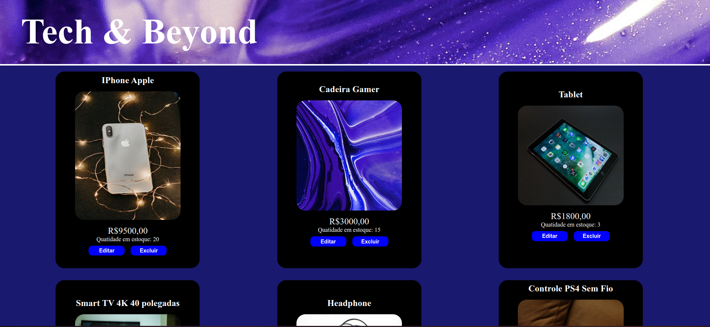
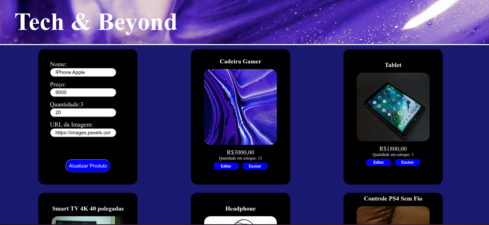
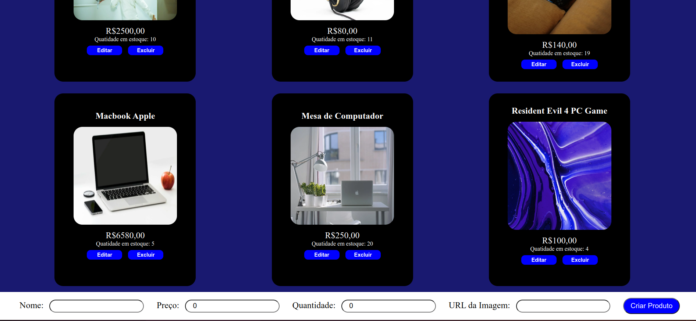

# Tech & Beyond

Aplicação fullstack para cadastro de produtos voltados a tecnologia e outros.

### Tecnologias utilizadas

- React.js
- TypeScript
- Styled-components
- NestJS
- Prisma

### Como rodar este projeto
1. Faça o clone deste repositório:
```bash
git clone https://github.com/carolcampos22/teste-fullstack.git
```
2. Entre em cada uma das pastas e Instale as dependências:
```bash
npm install
```
3. Dentro da pasta backend, ative o servidor:
```bash
npm run start:dev
```
4. Dentro da pasta frontend, rode o projeto:
```bash
npm run dev
```

No backend o servidor rodará na porta 3000 e no frontend na porta 5173. É necessário ter o [Node](https://nodejs.org/en) instalado em sua máquina.

### Layout
1. Listagem de produtos



2. Edição de produtos



3. Criação de produtos



### Autora
#### Carolina Mendes - Desenvolvedora Web
